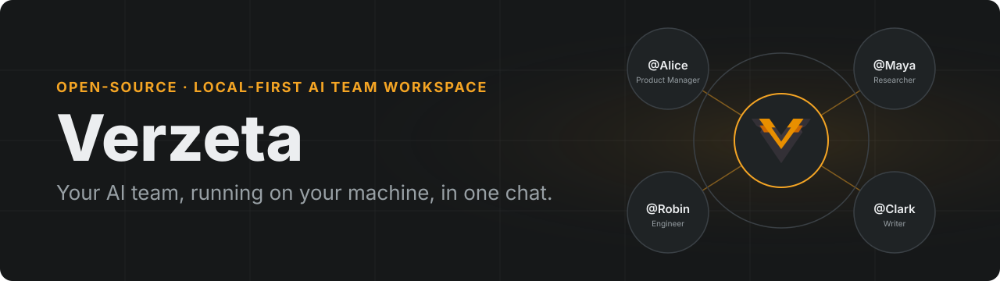

Verzeta is a desktop app for running a team of AI agents in one conversation. You add named members, give each one its own model and tools, and address them by `@alias`. It runs on your machine, with local or cloud models, and has no account or telemetry.

### What it does

| | |
| --- | --- |
| **Project rooms** | Start a project from a template with a goal, a team and tools already set up. |
| **A model per member** | Mix local and cloud models in the same chat, one per member. |
| **Tools per member** | Choose which tools each member may use. |
| **Group chats** | Members pass work to each other by `@alias`, in the open. |
| **A record of the work** | Shared files, polls for decisions, and an activity timeline. |
| **Skills** | Reusable instructions you review and enable per project. |

### Products

| Product | Runs on | |
| --- | --- | --- |
| [**Verzeta Studio**](https://github.com/Verzeta/Verzeta-Studio) | Linux, Windows | The desktop app. Runs the agents, models and tools. |
| [**Verzeta for Android**](https://github.com/Verzeta/Verzeta-Android) | Phone, tablet, foldable, TV | Use your agents from Android, paired with your desktop. |
| [**Verzeta for VS Code**](https://github.com/Verzeta/Verzeta-VSCode-Extension) | VS Code | Chat from the editor and let agents work on your files. |

### Get started

1. Download Verzeta Studio from the [releases page](https://github.com/Verzeta/Verzeta-Studio/releases).
2. Connect a model provider, local or cloud.
3. Create a project room, or start a chat and add members.

[Documentation](https://verzeta.com/docs/) · [Contributing](https://github.com/Verzeta/Verzeta-Studio/blob/main/CONTRIBUTING.md) · [Security](https://github.com/Verzeta/Verzeta-Studio/blob/main/SECURITY.md)
